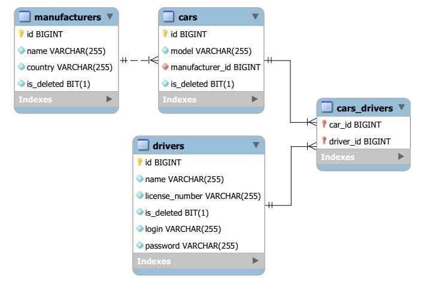

# Taxi-service

# Project description:
Taxi Service is a simple web application that simulates the work of a taxi service.
The project is implemented in Java with **SOLID principles** & **Dependency Injection**, has a 3-tier architecture.

## Project has next features:
- Display All Drivers
- Display All Cars
- Display All Current Cars
- Display All Manufacturers
- Create new Car
- Create new Manufacturer
- Add Driver to Car
- Delete Driver from Car

## Structure: 3-tier architecture:
- **DAO** - Data Tier
- **Service** - Business Tier
- **Controllers** - Presentation Tier

## Database diagram:

## Technologies:
- Java v.11;
- Apache Tomcat v.9;
- MySQL v.8;
- Maven v.3.8;
- Java Servlet v.4;
- JSTL v.1.2;
- In project used pattern of Dependency Injector.

## Instructions for run project:
- Configure TomСat (root's field must be "/").
- Copy, paste and run the script from this file src/main/resources/init_db.sql into MySQL. 
- In order to connect to the database it is necessary to add current data in the following fields URL, USERNAME, PASSWORD, JDBC_DRIVER in this file src/main/java/taxi/util/ConnectionUtil.java.
- Add configurations in TomCat Server.
- Start the project.

## You can test the APP using the browser of your PC. Click on the link: [*--> link*](https://service-taxi-nba.herokuapp.com)
